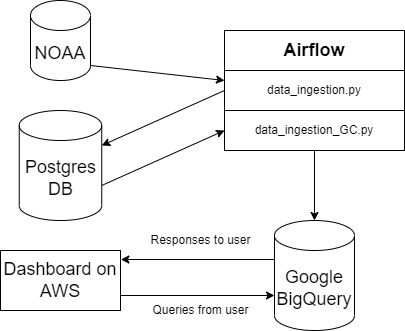

<strong>Weather project</strong>

Dataset from NOAA (National Oceanic and Atmospheric Administration):
 
https://www.ncei.noaa.gov/data/global-summary-of-the-day/archive/
 
 
<strong>Airflow</strong> has 2 DAG:
 
1.<strong>data_ingestion.py</strong> (<A href="./airflow/dags/data_ingestion.py">source</A> in <A href="./airflow/dags">DAG folder</A>) - loading data from NOAA-database to local <strong>Postgres DB</strong>. The NOAA-database contains many archives by year. Each archives contain many files with data from different weather stations. The Postgres database contains tables for every year since 1929.
 
2.<strong>data_ingestion_GC.py</strong> (<A href="./airflow/dags/data_ingestion_GC.py">source</A> in <A href="./airflow/dags">DAG folder</A>) - loading data from <strong>Postgres DB</strong> to <strong>Google BigQuery</strong>. In Google BigQuery there is only one partitioned (by date) table "day_stat_part_date".
 
   
Dashboard developed in Dash Python (<A href="./dash">dash folder</A>). The application was dockerized and uploaded to AWS Elastic Beanstalk. 
<strong>Demonstration version:</strong> 
http://weatherworld.us-east-2.elasticbeanstalk.com/
 
This application query data from Google BigQuery.
  
<strong>How to start:</strong> 
1.Make network: 
docker network airflow_default 
2.Start Postgres with PGAdmin: 
docker compose docker-compose.yaml 
3.Start Airflow: 
docker airflow/compose docker-compose.yaml 
4.Start demonstration application from http://weatherworld.us-east-2.elasticbeanstalk.com/ or manually: 
python dash/app/main.py
